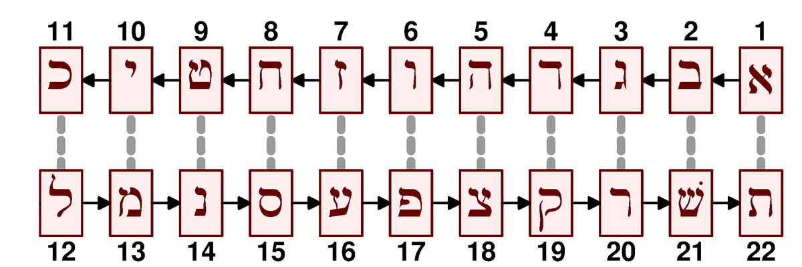
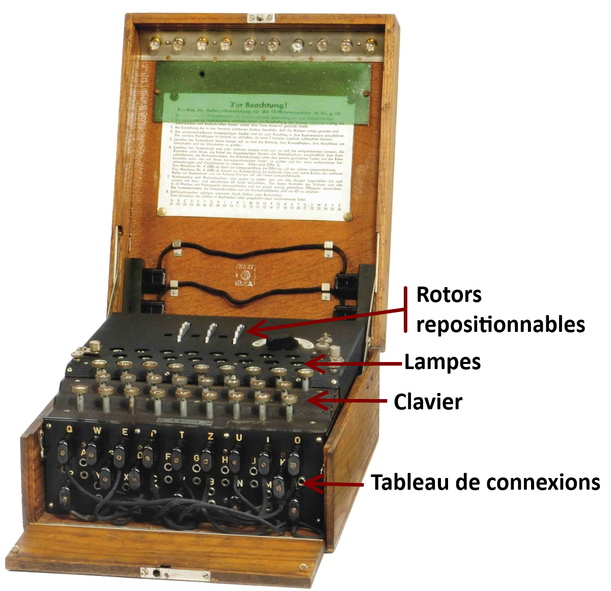
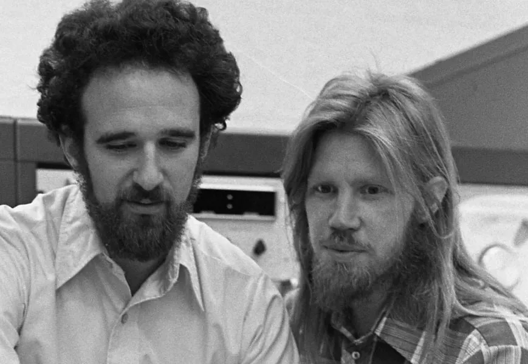
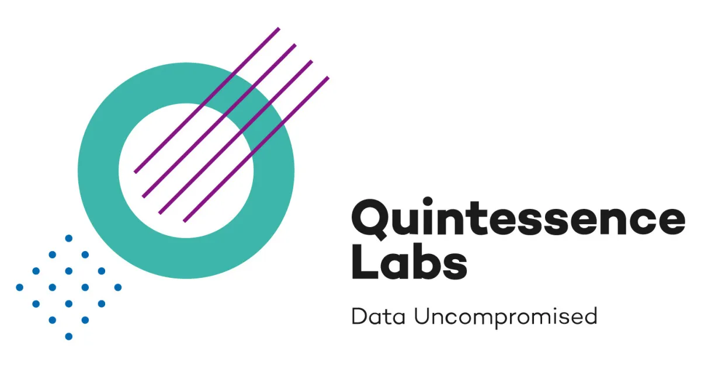

Un concept « vieux comme le monde »...

---

# 500 avant J.C., peuple Hébreu

---

Code Atbash

---

# 400 avant J.C., Grèce

---

Scytale

{width=50%}

---

# 50 avant J.C., Rome

---

Code de César

{width=75%}

---

# Fin XVIe Siècle, France

---

Chiffre de Vigenère

{width=30%}

- inventé par le diplomate Blaise Vigenère ;
- cassé 2 siècles plus tard.

---

# Fin XIXe, Pays-bas

---

{width=15%}

Principe de Kerckhoffs :

*« la sécurité d’un système ne doit
pas dépendre de la préservation du secret de l’algorithme,
mais reposer sur le secret de la clef »*

---

# 1917, Etats-Unis

---

Technique du *masque jetable*

Principe:

- créer un masque *aléatoire* à usage unique de même taille que le message à coder ;
- appliquer une opération de type XOR.

---

- seul système théoriquement sûr : pas d'autre moyen que la force brute.
- en pratique, comment échanger le masque ?
- utilisé par Ché Guevarra et Fidel Castro pour communiquer entre eux.

---

# 1918, Allemagne

---

Création de la machine Enigma

{width=20%}

- Utilisée par l'Allemagne nazie ;
- cassée par A. Turing et M. Rejewski.

---

# 1975, Etats-Unis

---

DES : Data Encryption Standard

- système de chiffrement *symétrique* ;
- clé privée de 56 bits ;
- créé pour sécuriser les communications d'entreprises.

---

Symétrique ?

---

Tous les systèmes précédents sont symétriques :

- la clé pour chiffrer est la même que celle qui sert à déchiffrer.

---

# 1976, Etats-Unis 

---

Chiffrement asymétrique

{width=40%}

- Diffie et Hellman introduisent l'idée de *clé privée* et *clé publique* ;
- principe établi, mais pas vraiment concrétisé...

---

# 1977, Etats-Unis

---

RSA

{width=40%}

- chiffrement asymétrique ;
- crée par Rivest, Shamir et Adleman ;
- LAAARGEMENT utilisé encore aujourd'hui : cartes bancaires, protocole HTTPS...

---

# 1991, Etats-Unis

---

MD5

Créé par Rivest (le R de RSA).

Fonction de hachage servant à

- générer des empreintes de fichiers ;
- générer des mots de passes ;
- signer numériquement des documents.

---

MD5 est abandonné aujourd'hui au profit de SHA-256 (par exemple).

---

# 1994 

---

HTTPS

Netscape crée une version sécurisée de HTTP basée sur 

- un système de chiffrement asymétrique de type RSA ;
- un système de chiffrement symétrique.

---

# 2000

---

AES : Advanced Encryption Standard 

{width=30%}

---

- système de chiffrement *symétrique* successeur
de DES utilisant une clef de 128 à 256 bits ;
- utilisé dans les routeurs WIFI (WPA2), les chaînes TV cryptées et dans HTTPS également;

---

# Début XXIe siécle

---

Utilisation de la physique quantique pour la cryptographie

{width=50%}

---

# 2009

---

BITCOIN

{width=50%}

Apparition de la première cryptomonnaie basée (entre autres) sur la fonction de hachage SHA-256.