# Vocabulaire

---

- **chiffrer** : utiliser un algorithme pour transformer un message en un autre, incompréhensible sans clé/algorithme ;
- **déchiffrer** : utiliser un algorithme et/ou un clé pour transformer un message incompréhensible en un autre,
  compréhensible ;
- **cryptographie** : science du chiffrement/déchiffrement ;
- **décryptage** : retrouver un message original *sans clé ni algorithme* ;

---

# Chiffrement symétrique

---

---

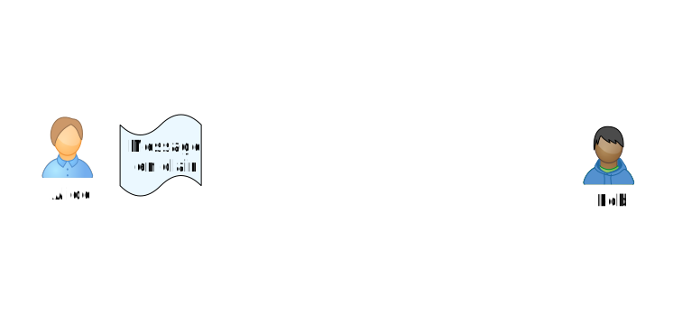

---

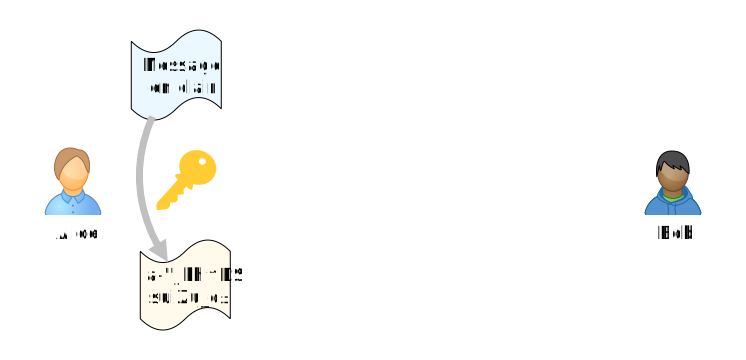

---

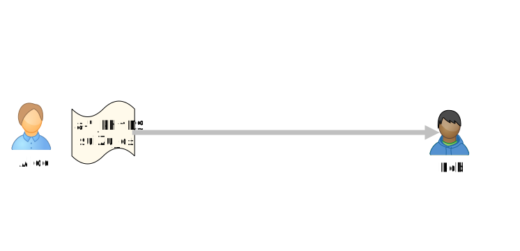

---

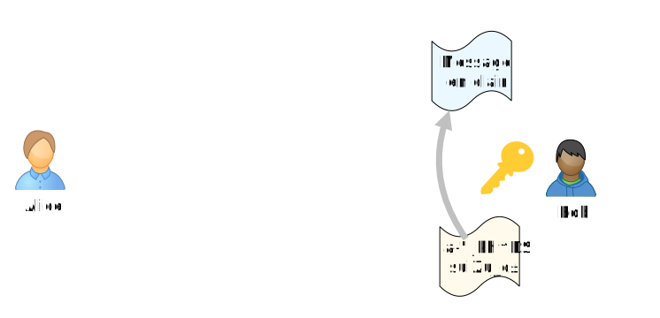

---

- Problème : comment faire pour transmettre la clé publique en toute sécurité ?

- Avantage : algorithmes rapides en général.

---

# Chiffrement asymétrique

---

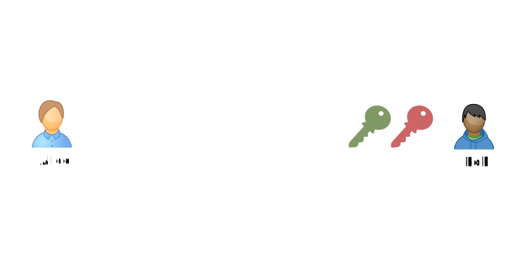

---

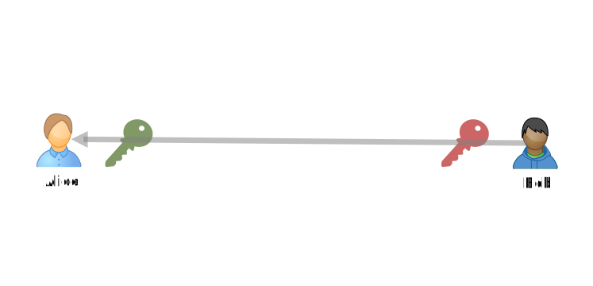

---

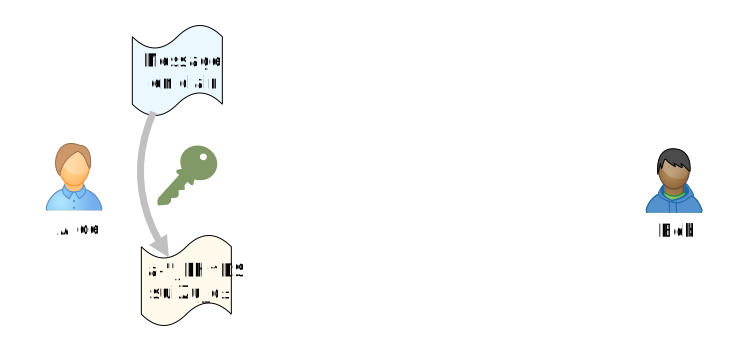

---

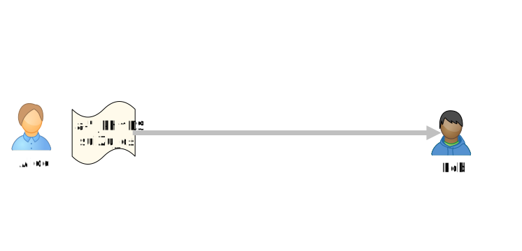

---

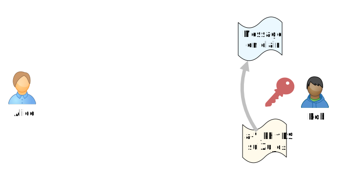

---

- Avantage : Pas de problème de transmission de clé comme avec le chiffrement symétrique ;
- Inconvénient : Algorithmes souvent plus lents (environ 1000 fois) que pour le chiffrement symétrique.

---

# Fonctions de hachage

---

L'ensemble des fichiers est gigantesque mais « creux » :

- 1 ko = 8000 bits : il y a $2^{8000}$ fichiers de taille 1ko ;
- cela fait de l'ordre de $10^{2408}$ fichiers ;
- parmi tout ceux-là, seuls un nombre restreint sont de « vrais » fichiers.

---

Une fonction de hachage transforme un fichier (de volume arbitraire) en signature de taille fixe, beaucoup plus petite
avec les caractéristiques suivantes :

- il est impossible de reconstituer le fichier à partir de l'empreinte ;
- en pratique, des fichiers différents ont des empreintes distinctes ;
- si on change un bit du fichier de départ, l'empreinte change du tout au tout.

---

# Signature numérique

---

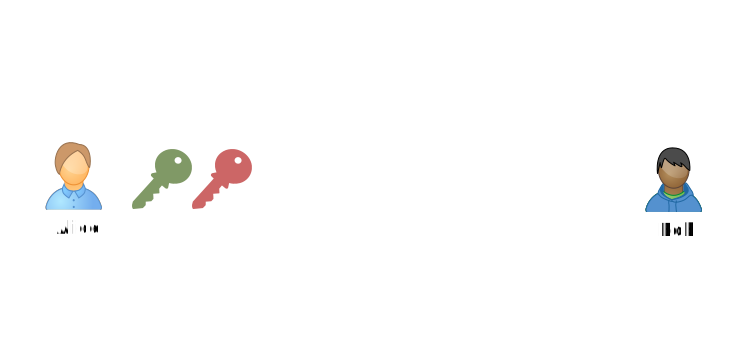

---

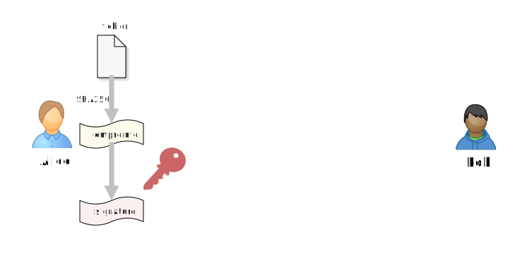

---

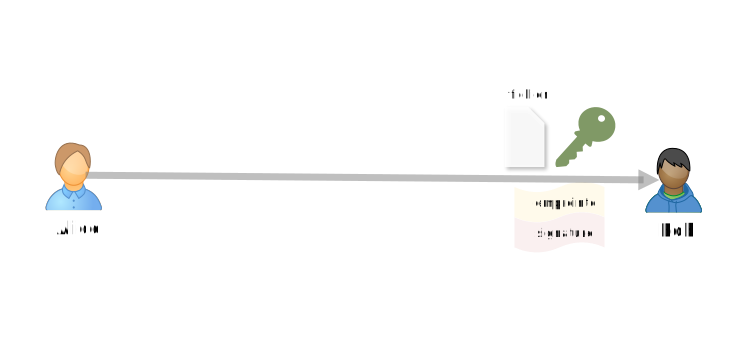

---

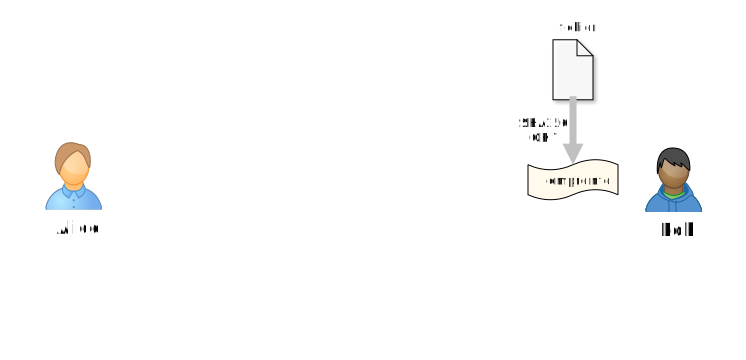

---

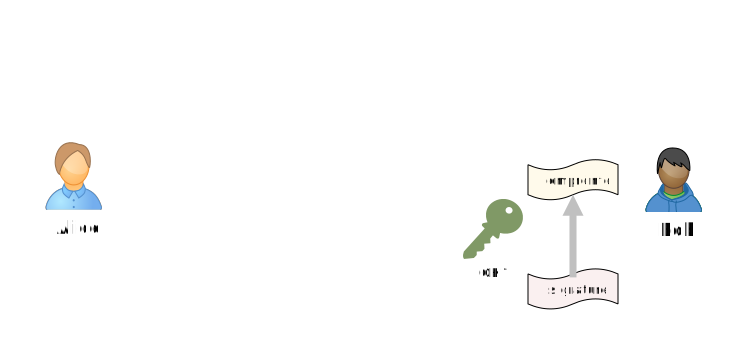

---

# HTTPS

---

---

---

---

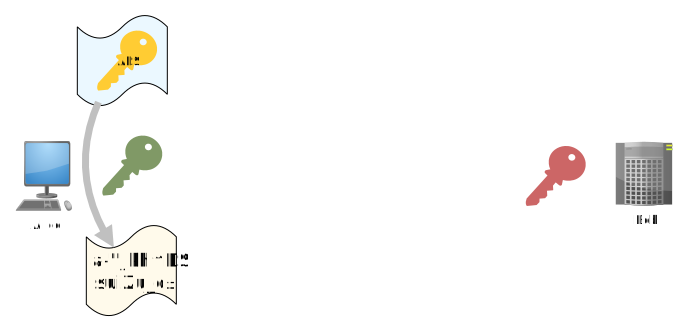

---

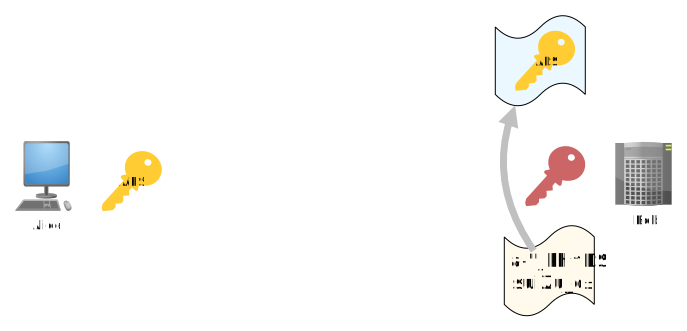

---

