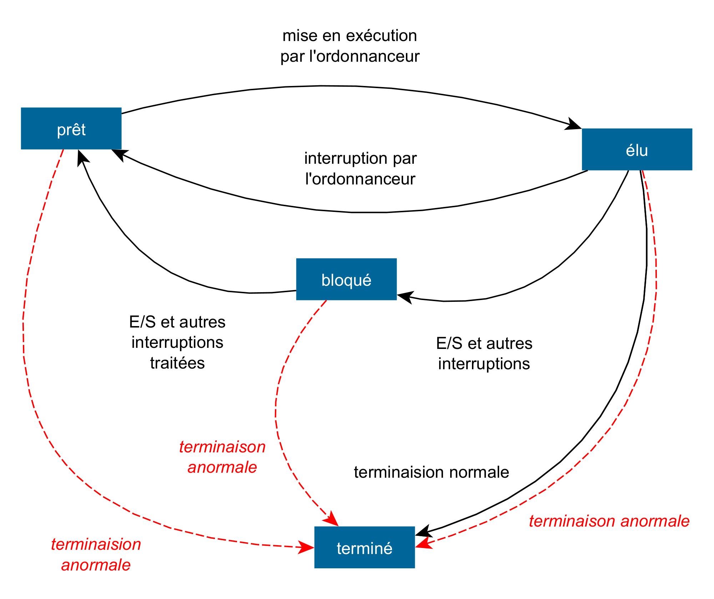

# Exercice 1

### Question 1

Les attributs `idPiece` et `idActeur` de `Role` sont des *clés étangères* : elle font référence à des attributs dans les
tables `Piece` et  `Acteur`. Insérer des valeurs dans `Role` sans que les valeurs correspondantes existent dans `Piece`
et  `Acteur` violerait les contraintes d'intégrité de la BDD (ici les contraintes de référence).

### Question 2

`````sql
INSERT INTO Role
VALUES (46721, 389761, "Tartuffe")
`````

### Question 3

Cette requête met à jour la table `Piece` en remplaçant les valeurs `Américain` et `Britannique` de l'attribut `langue`
par la valeur `Anglais`.

### Question 4

#### a.

```sql
SELECT nom, prenom
FROM Acteur
WHERE anneeNaiss > 1990;
```

#### b.

```sql
SELECT max(anneeNaiss)
FROM Acteur;
```

#### c.

```sql
SELECT nom
FROM Role
         JOIN Acteur ON Acteur.idActeur = Role.idActeur
WHERE Acteur.nom = "Macaigne"
  AND Acteur.prenom = "Vincent";
```

#### d.

```sql
SELECT titre
FROM Piece
         JOIN Role ON Role.idPiece = Piece.idPiece
         JOIN Acteur ON Acteur.idActeur = Role.idActeur
WHERE Piece.langue = "Russe"
  AND Acteur.nom = "Balibar"
  AND Acteur.prenom = "Jeanne";
```

# Exercice 2

### Question 1

#### a.

```python
pile1 = Pile()
pile1.empiler(7)
pile1.empiler(5)
pile1.empiler(2)
```

#### b.

L'affichage est `7, 5, 5, 2`

### Question 2

#### a.

- L'affichage est `3, 2`.

- L'affichage est `3, 2, 5, 7`.

- L'affichage est `3`.

- L'affichage est `pile vide`.

#### b.

On peut sans doute envisager la fonction `mystere` de plusieurs manières. Elle semble permettre d'accéder à un élément
donné dans une pile donnée en procédant ainsi : elle renvoie une pile avec les éléments de la première dans l'ordre
inverse et l'élément sur son sommet s'il se trouve dans la pile de départ. Si ce n'est pas le cas, tous les éléments de
la pile de départ sont dépilés.

À l'issue de cette fonction, on peut sans doute traiter le sommet de la pile de retour (pour modifier / insérer /
supprimer) et empiler de nouveau sur la pile de départ.

### Question 3

En lisant les tests on comprend que la fonction modifie aussi `pile2`, ainsi on écrit :

```python
def etendre(pile1, pile2):
    for _ in pile2.nb_elements():
        pile1.empiler(pile2.depiler())
```

### Question 4

```python
def supprime_toutes_les_occurences(pile, element):
    pile2 = Pile
    for _ in pile.nb_elements():
        e = pile.depiler()
        if e != element:
            pile2.empiler(e)
    for _ in pile2.nb_elements():  # On peut utiliser 
        # etendre à la place
        pile1.empiler(pile2.depiler())

```

# Exercice 3

## Questions préliminaires

### Question 1

1 < 3 et 8 > 7 donc `(1, 3)` est une inversion dans ce tableau.

### Question 2

2 < 3 mais 3 < 7, donc `(2, 3)` n'en est pas une.

## Partie A

### Question 1

#### a.

- La fonction renvoie 0.
- La fonction renvoie 1.
- La fonction renvoie 2.

#### b.

`fonction1(tab, i)` renvoie le nombre d'inversions du type `(i, j)` dans `tab`, avec i < j.

### Question 2

Pour comptabiliser toutes les inversions d'un tableau on va procéder en itérant sur le premier élément du couple et en
utilisant `fonction1` :

```python
def nombre_inversions(tab):
    resultat = 0
    for i in range(len(tab) - 1):  # inutile d'aller jusqu'au 
        # dernier élément
        resultat += fonction1(tab, i)
    return resultat
```

### Question 3

Pour un tableau de taille $n$, on parcourt ce tableau du premier à l'avant dernier élémént dans `nombre_inversions`, et
à la ième itération on appelle `fonction1` qui, elle, nécessite $n-i-1$ opérations.

Suivant un résultat bien connu, il faut environ $\frac{n}{2}$ opérations pour effectuer `nombre_inversions`.

On peut donc dire que l'ordre de grandeur de la complexité en temps de l'algorithme est $n^2$, c'est-à-dire qu'il est
*quadratique*.

## Partie B

### Question 1

Nous avons vu que le tri fusion a une complexité meilleure que quadratique (plus précisément en $n\ln n$).

### Question 2

Soit $n$ la taille de `tab`

- si $n$ est pair, on veut renvoyer les $\frac{n}{2}$ premiers éléments, et `(n+1)//2` est aussi `n//2`;
- sinon on veut renvoyer les $\frac{n+1}{2}$ premiers (le $+1$ est là pour avoir un résultat pair et aussi pour que l'
  elément au centre soit inclus) et là aussi `(n+1)//2` nous donne le bon nombre d'éléments.

```python
def moitie_gauche(tab):
    return tab[:(len(tab) + 1) // 2]
```

### Question 3

```python
def nb_inversions_rec(tab):
    resultat = 0
    if tab: # produit le cas d'arrêt quand tab est vide
      # on divise
      gauche, droite = moitie_gauche(tab), moitie_droite(tab)
      # on applique la fonction récursive 3 fois
      resultat += nb_inversions_rec(gauche)
      resultat += nb_inversions_rec(droite)
      resultat += nb_inversions_rec(tri(gauche) + tri(droite))
    return resultat
```

# Exercice 4

### Question 1
#### a.

Le processus est élu quand l'ordonnanceur lui donne la priorité.

#### b. 
Voir figure 1.



### Question 2

